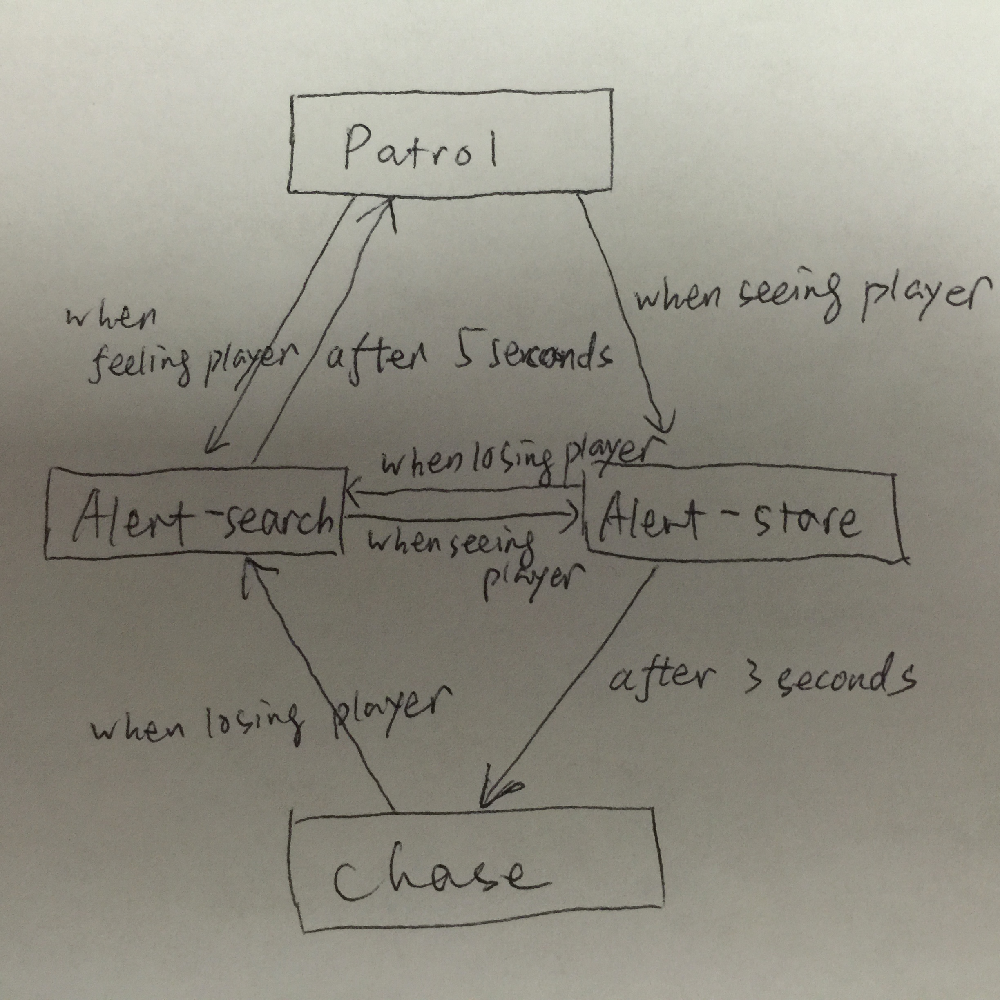

# Final Puzzle State Machine

## Introduction
This state machine contains three main states: `Patrol`, `Alert` and `Chase`, while `Alert` state is further divided into two states: `Alert-search`,  and `Alert-stare`.

## Patrol
* Action: walks through waypoints
* Transitions:
 - to `Alert-search`: when AI 'feels player is close'
 - to `Alert-stare`: when AI 'sees player'

## Alert-search
* Action: turns around to search player
* Transitions:
 - to `Alert-stare`: when AI 'sees player'
 - to `Patrol`: after AI 'turns around to search player' for 5 seconds

## Alert-stare
* Action: stares at player
* Transitions:
 - to `Alert-search`: when AI 'loses player'
 - to `Chase`: after AI 'stares at player' for 3 seconds

## Chase:
* Action: runs to player
* Transitions:
 - to `Alert-search`: when AI 'loses player'